# Wazuh SOC Investigation for Splunk

Wazuh SOC Investigation is a Splunk app for investigating Wazuh security alert data. It provides SOC-focused dashboards for alert overview, authentication activity, MITRE ATT&CK mapping, host investigation, incident timeline, alert triage, vulnerability data, and file integrity monitoring.

App repository:
https://github.com/kaledaljebur/wazuh-soc-investigation

This repository is a usage guide for the app. It is intended for analysts and Splunk administrators who want to install, configure, and operate the app.

---

## 📌 What the App Does

- Summarises Wazuh alert activity across time, host, rule, and severity.
- Shows authentication success/fail trends, top hosts and rules for auth activity.
- Maps Wazuh rules to MITRE ATT&CK tactics and techniques, using the tags already present in the Wazuh ruleset (no separate lookup file needed).
- Provides investigation views by host, and a per-host chronological incident timeline.
- Tracks alert triage status (open, archived, escalated) with analyst comments.
- Shows File Integrity Monitoring (FIM) events from Wazuh's syscheck module.
- Shows vulnerability data pulled from the Wazuh Indexer API, since Wazuh 4.8+ no longer sends vulnerability data through alerts.

---

## 🚀 Installation

Install the app package (`wazuh-soc-investigation.tgz`) from the app repository:

https://github.com/kaledaljebur/wazuh-soc-investigation

In Splunk Web: Apps > Manage Apps > Install app from file, select the package.

After installation, open the app from the Splunk App Launcher:

```text
Wazuh SOC Investigation
```

> ℹ️ Note: This app is in early development and not yet on Splunkbase.

> ℹ️ Note: After installing, updating, or removing the app, restart Splunk if the app icon or the Wazuh Vulnerability Input data input doesn't appear right away.

---

## ✅ Required Data

The app expects Wazuh alert events to already be indexed and searchable in Splunk, for example forwarded from `alerts.json` on the Wazuh manager.

> ℹ️ Note: This app does not collect or ingest Wazuh data. It analyses Wazuh data that is already available in Splunk.

Typical Wazuh fields used by the dashboards include:

- `rule.id`
- `rule.level`
- `rule.description`
- `rule.groups`
- `rule.mitre.id`, `rule.mitre.tactic`, `rule.mitre.technique`
- `agent.name`, `agent.ip`
- `predecoder.hostname`
- `syscheck.path`, `syscheck.event`
- `full_log`

The default search scope is:

```text
index=wazuh
```

If your data is stored somewhere else, use the Search Scope dashboard to change the app-wide default.

> 💡 Tip: Start by opening the Search Scope dashboard. If the preview table returns events, the rest of the dashboards are much more likely to work as expected.

---

## 📊 Dashboard Guide

### Wazuh Overview

Use this dashboard for the first high-level review of Wazuh alert activity. It shows alert trends, top rules, top hosts, severity distribution, top rule groups, and recent alerts.

Screenshot:

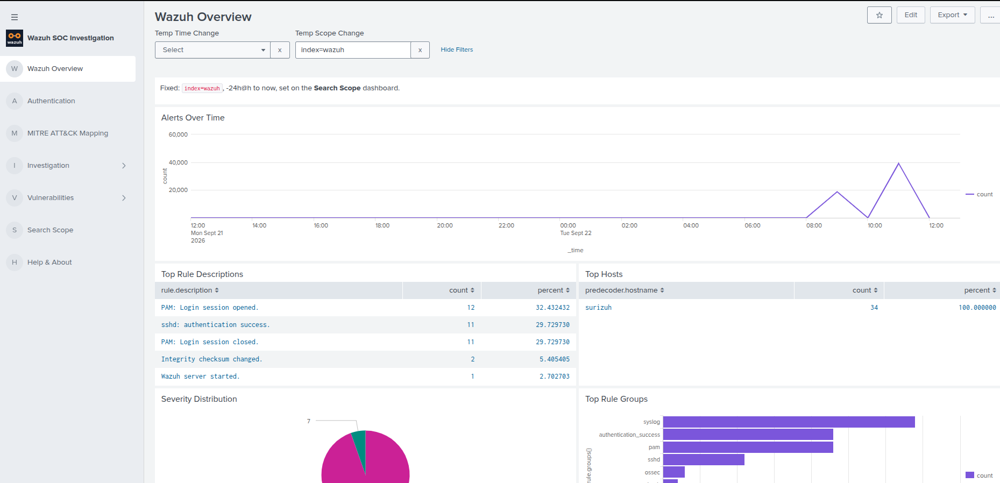

### Authentication

Use this dashboard to review login activity. It shows auth success/fail trends over time, top hosts by failed logins, and top authentication rule descriptions.

Screenshot:

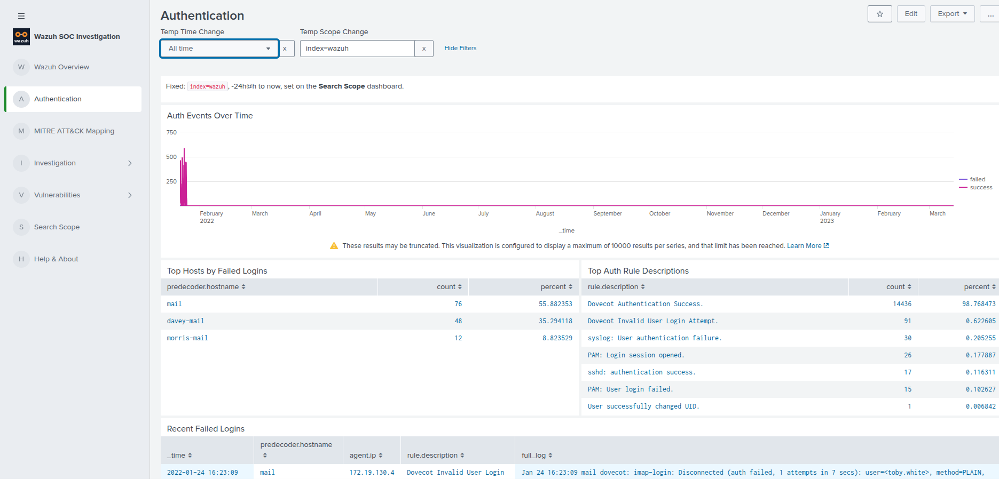

### MITRE ATT&CK Mapping

Use this dashboard to view Wazuh alert activity by MITRE ATT&CK tactic and technique. Mapping comes directly from the Wazuh ruleset, no separate lookup file is used.

Screenshot:

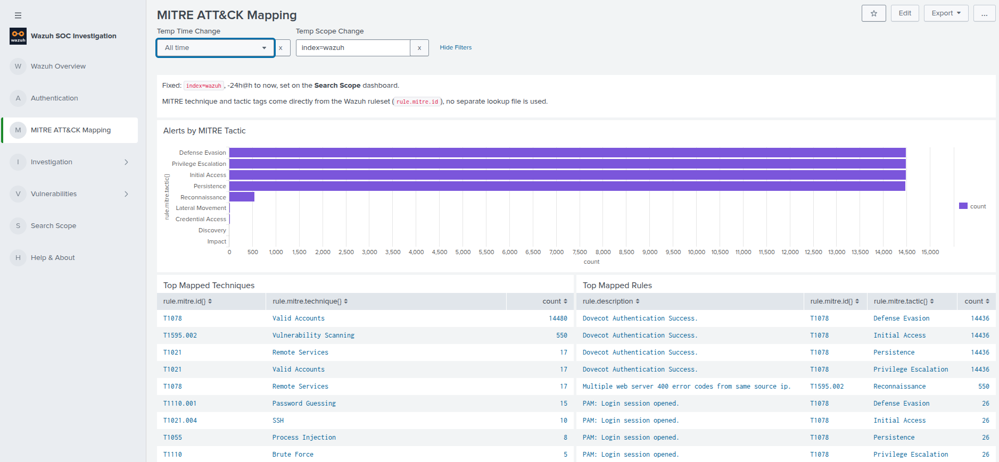

### Host Investigation

Use this dashboard to investigate activity for a single host.

Screenshot:

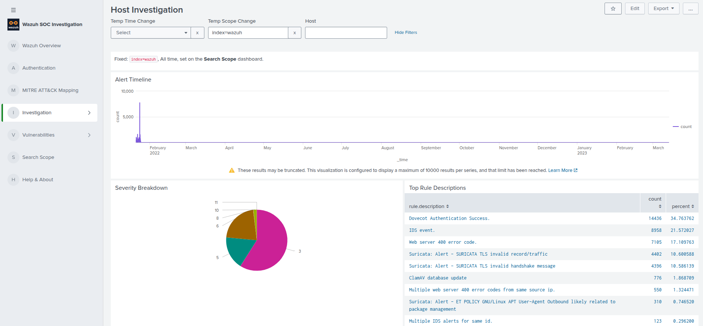

### Incident Timeline

Use this dashboard to reconstruct a per-host chronological alert history. Wazuh alerts are host events, not network sessions, so this is not session-based like a network IDS timeline. Click a host row to see its full alert history.

Screenshot:

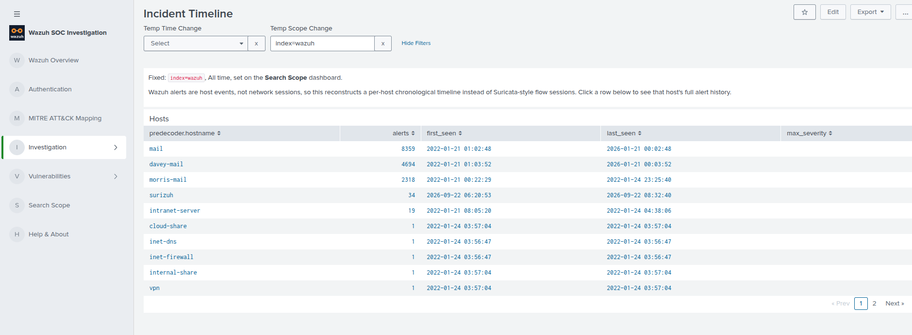

### Alert Triage

Use this dashboard to track which alerts have been reviewed. Click a row in the Alerts table to select it, choose a status (Open, Archived, Escalated), add an optional comment, then click Submit to save. Use Status Filter to show only Open, Archived, or Escalated alerts.

Screenshot:

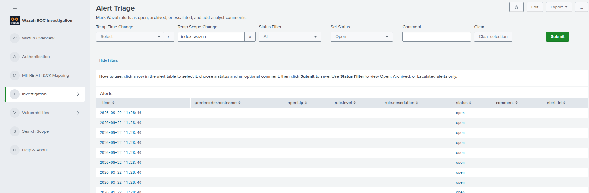

### Vulnerabilities

Use this dashboard to review vulnerability findings by severity, CVE, package, and agent. Wazuh 4.8+ does not send vulnerability data through `alerts.json`, so this dashboard reads from a modular input instead. See "Vulnerability Data Setup" below.

Screenshot:

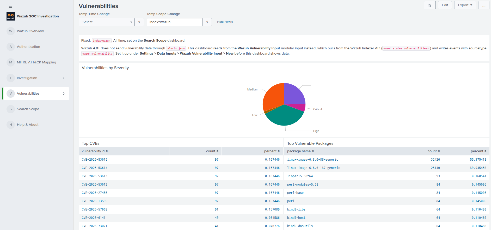

### File Integrity Monitoring

Use this dashboard to review file integrity events (added, modified, deleted) from Wazuh's syscheck module. Needs FIM enabled on the agent.

Screenshot:

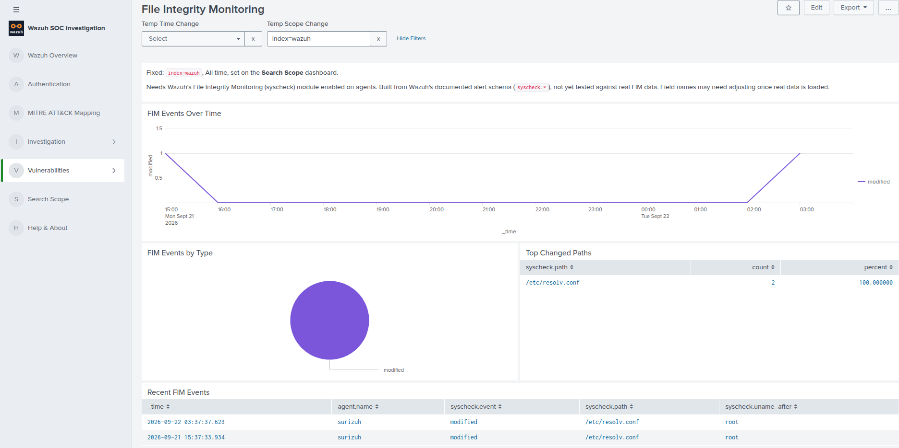

### Search Scope

Use this dashboard to set the default search scope and time range used by the app dashboards.

Screenshot:

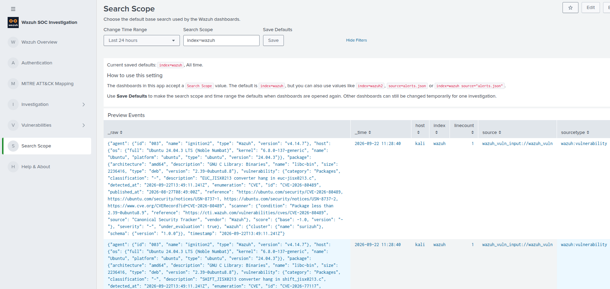

---

## 🧬 CIM Support

The app tags Wazuh alerts as an eventtype for the CIM **Intrusion Detection** data model.

- Tags: `ids`, `attack`
- The mapping applies to any event in `index=wazuh` with a `rule.id` field, no fixed sourcetype required.
- This is tag-only, there are no CIM field aliases, since Wazuh data does not arrive under one fixed sourcetype.
- The dashboards do not need CIM. They work regardless of this mapping.

---

## 🧭 Search Scope and Time Range

The app uses a saved settings lookup to remember the default search scope and time range.

Settings lookup:

```text
lookups/wazuh_settings.csv
```

Example:

```csv
setting,value
search_scope,index=wazuh
earliest,-24h@h
latest,now
```

Time range is set with Splunk's native time picker on the Search Scope dashboard, so any preset or custom/absolute range is supported. Click **Save Defaults** to make the current search scope and time range the defaults every dashboard opens with.

Every other dashboard has **Temp Time Change** and **Temp Scope Change**. A note above them shows the current saved defaults, for example "Fixed: index=wazuh, All time, set on the Search Scope dashboard". Use these controls to change the scope or time range temporarily on that dashboard only, and use the small **x** next to each one to reset it back to the saved default.

> ℹ️ Note: Saved defaults are intended for administrators. Analysts can still adjust Search Scope and Time Range temporarily on individual dashboards.

---

## 🧩 CSV Lookup Files

The app uses two CSV lookup files.

### Alert Triage lookup

```text
lookups/wazuh_triage.csv
```

This file stores alert triage status and analyst comments, keyed by a hash of each alert's host, rule, and time.

Columns:

```csv
alert_id,status,comment,updated_time
```

### App settings lookup

```text
lookups/wazuh_settings.csv
```

This file controls saved dashboard defaults (search scope and time range).

Columns:

```csv
setting,value
```

---

## 🛠️ Editing CSV Lookups

Splunk administrators have two practical options for editing the app CSV lookups.

### 🛠️ Option 1: Use the In-App Editors

Best for quick edits from inside the Wazuh SOC Investigation app, without leaving Splunk.

- **Alert Triage** - set an alert's status and comment in `wazuh_triage.csv`.
- **Search Scope** - set the saved search scope and time range in `wazuh_settings.csv`.

Each works the same way: open the dashboard, change the fields, then click **Submit** or **Save Defaults** to write the change back to the CSV with `outputlookup`.

Splunk may show a security warning because the app uses `outputlookup` to save CSV changes. This is expected when saving lookup changes from a dashboard.

> 📌 Important: Only trusted users who are allowed to edit lookup files should save changes from the in-app editors.

### 📝 Option 2: Edit the CSV Files Manually

Best for packaging, version control, scripted updates, or server-side maintenance.

Files:

```text
$SPLUNK_HOME/etc/apps/wazuh-soc-investigation/lookups/wazuh_triage.csv
$SPLUNK_HOME/etc/apps/wazuh-soc-investigation/lookups/wazuh_settings.csv
```

After manual changes, refresh Splunk knowledge objects or restart Splunk if needed.

> ⚠️ Warning: Be careful when editing CSV files manually. Keep the header row unchanged and back up the file before large edits.

> 📌 Note: The [Suricata SOC Investigation](https://github.com/kaledaljebur/suricata-soc-investigation) README covers the same CSV editing steps with screenshots. The same options apply here.

Useful refresh URL:

```text
http://YOUR_SPLUNK:8000/en-US/debug/refresh
```

---

## 🔐 Vulnerability Data Setup

Wazuh 4.8+ moved vulnerability data to a separate model: a synced inventory in the Wazuh Indexer (`wazuh-states-vulnerabilities*`), not events in `alerts.json`. The classic Wazuh API `/vulnerability/{agent_id}` endpoint is fully removed from 4.8 onward. So this dashboard needs its own data path.

The app ships a modular input for this, **Wazuh Vulnerability Input**. Everything is configured from Splunk Web, no files to edit or transfer.

Setup:

1. Go to **Settings > Data Inputs > Wazuh Vulnerability Input > New**.
2. Fill in the indexer host, username, and password. A read-only account (Wazuh's built-in `readall` user) is enough. The password is stored encrypted by Splunk, not in a plain file.
3. Save. The input runs on a schedule (default every hour), queries `wazuh-states-vulnerabilities*` on the indexer, and writes results with sourcetype `wazuh:vulnerability`.
4. Requires **vulnerability-detection** enabled in the Wazuh manager's `ossec.conf`, and the indexer reachable from wherever Splunk runs. By default the Wazuh indexer only listens on `127.0.0.1`, so it needs to be bound to a reachable address as well (keep `127.0.0.1` in the list too, the manager needs it locally).

> ⚠️ Warning: Exposing the Wazuh indexer beyond localhost increases its attack surface. Use a read-only account and restrict network access to the Splunk server where possible.

> ℹ️ Note: **Wazuh Vulnerability Input** may not be on the first page of Settings > Data Inputs, use the filter box or paging at the bottom. It appears right after installing the app, no restart needed. If you remove or reinstall the app, the old entry stays listed until Splunk is restarted.

### Setup Walkthrough

Fill in the form under **Settings > Data Inputs > Wazuh Vulnerability Input > New**:

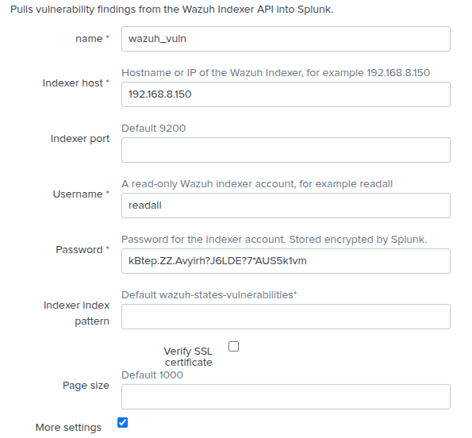

Add the interval, source type, and index under **More settings**. The index must already exist, use the same one as your Search Scope setting (`index=wazuh` by default), or create it first under **Settings > Indexes > New Index**:

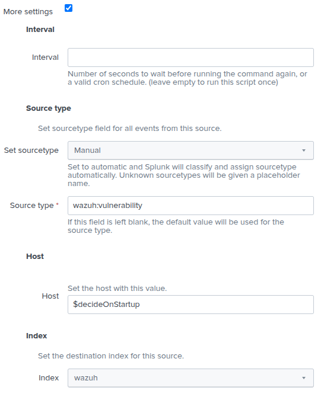

Once saved, confirm data is flowing with a test search:

```text
index=wazuh sourcetype="wazuh:vulnerability"
```

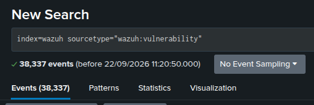

---

## ✅ Recommended Admin Workflow

1. Install the app.
2. Confirm Wazuh data is searchable in Splunk.
3. Open the Search Scope dashboard and confirm the app is searching the correct data.
4. Review the Wazuh Overview and Authentication dashboards.
5. Check the MITRE ATT&CK Mapping dashboard.
6. Use Host Investigation and Incident Timeline dashboards for deeper analysis.
7. Use Alert Triage to mark alerts as open, archived, or escalated as you review them.
8. Set up the Vulnerability Data Setup steps above if you want the Vulnerabilities dashboard populated.
9. Enable FIM on agents if you want the File Integrity Monitoring dashboard populated.

---

## 🔎 Troubleshooting

### Dashboards are empty

Check the Search Scope and Time Range. Make sure the scope matches where your Wazuh data is stored.

Examples:

```text
index=wazuh
index=wazuh2
source=alerts.json
```

### Vulnerabilities dashboard is empty

Check that the Wazuh Vulnerability Input is configured and enabled (see "Vulnerability Data Setup"), that vulnerability-detection is enabled on the Wazuh manager, and that the manager's CVE feed sync has completed (first sync can take a while).

### File Integrity Monitoring dashboard is empty

Check that syscheck (FIM) is enabled in the Wazuh agent's configuration.

### Splunk shows an outputlookup warning

This is expected when saving lookup changes from a dashboard. Only users who are allowed to edit lookups should run the save action.

### If changes do not appear immediately

Refresh Splunk knowledge objects:

```text
http://YOUR_SPLUNK:8000/en-US/debug/refresh
```

or restart Splunk if required by your deployment.

---

## 📌 Known Notes

- This app does not ingest Wazuh data by itself.
- Wazuh alert data must already be indexed and searchable in Splunk.
- Vulnerability data needs the separate Wazuh Vulnerability Input modular input (see above), it does not come through `alerts.json`.
- The app is designed for Wazuh alert investigation and is still in early development.

---

## 🤝 Support

Developer: Kaled Aljebur

Email:

```text
kaledaljebur@gmail.com
```

Contact me if you need a customised version of this app or a custom Splunk app for your environment.
